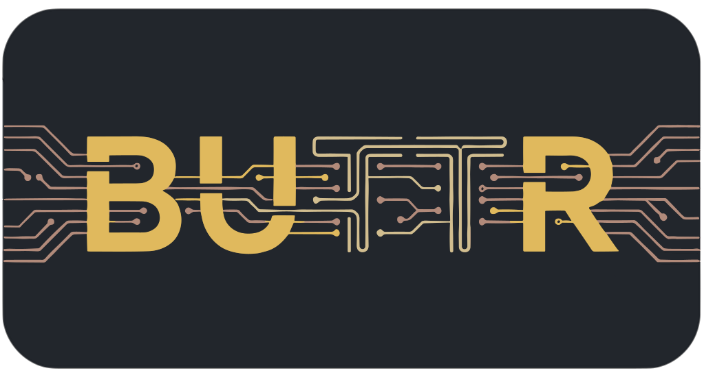

<p align="center">
  
</p>

<p align="center">
  <strong>A lightweight dependency-injection container for Unity 6+.</strong>
</p>

<p align="center">
  <a href="https://github.com/Crumpet-Labs/Buttr.Unity/releases"></a>
  <a href="https://github.com/Crumpet-Labs/Buttr.Unity/blob/main/LICENSE"></a>
  <a href="https://unity.com"></a>
</p>

Buttr adds Unity-specific integration on top of the engine-agnostic [Buttr.Core](https://github.com/Crumpet-Labs/Buttr.Core) DI library: source-generated MonoBehaviour injection, ScriptableObject registration, scene-walking injectors, and editor scaffolding for a suffix-driven architecture.

## Installation

Buttr.Unity depends on Buttr.Core. UPM doesn't auto-resolve git-URL dependencies, so install Core **first**, then Unity. In `Window > Package Manager` → `+` → **Install package from git URL**:

1. Install Buttr.Core:

   ```
   https://github.com/Crumpet-Labs/Buttr.Core.git?path=package
   ```

2. Install Buttr.Unity:

   ```
   https://github.com/Crumpet-Labs/Buttr.Unity.git?path=Assets/Plugins/Buttr
   ```

Pin versions by appending a tag (e.g. `#v1.3.3` for Core, `#v2.4.0` for Unity). Requires Unity 6.0+.

## Getting started

1. `Tools > Buttr > Setup Project` scaffolds `_Project/`, `Main.unity` boot scene, `Program.cs`, `ProgramLoader`.
2. Register a service in `Program.cs`:

   ```csharp
   var builder = new ApplicationBuilder();
   builder.Resolvers.AddSingleton<IGreeter, Greeter>();
   return builder.Build();
   ```

3. Inject it into a `partial` MonoBehaviour:

   ```csharp
   public partial class Welcome : MonoBehaviour {
       [Inject] private IGreeter m_Greeter;
   }
   ```

4. Add a `SceneInjector` to your scene, press Play.

Full walkthrough: [Docs/Guides/GettingStarted.md](Docs/Guides/GettingStarted.md).

## Documentation

| Topic | Guide |
|---|---|
| UPM install, updating, version pinning | [Installation](Docs/Guides/Installation.md) |
| First project end-to-end | [Getting Started](Docs/Guides/GettingStarted.md) |
| Suffix-driven architecture | [Conventions](Docs/Guides/Conventions.md) |
| `[Inject]` + injectors | [MonoBehaviour Injection](Docs/Guides/MonoBehaviourInjection.md) |
| Designer-facing data | [ScriptableObjects](Docs/Guides/ScriptableObjects.md) |
| Setup project + scaffolding | [Editor Tooling](Docs/Guides/EditorTooling.md) |
| Boot pipeline | [Loaders](Docs/Guides/Loaders.md) |

Engine-agnostic core (aliasing, `All<T>()`, `DIBuilder`, `Hidden`, analyzer catalogue): [Buttr.Core docs](https://github.com/Crumpet-Labs/Buttr.Core/tree/main/Docs).

## Contributing

Contributions are welcome. Open an issue first to discuss what you'd like to change. See [CONTRIBUTING.md](CONTRIBUTING.md).

## License

MIT — see [LICENSE](LICENSE).
